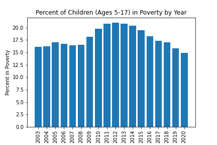

# Healthy Hunger Free Kids Act and its Effects on Obesity in the United States 

## Overview
In this collaborative repository, the relationship between the initiation of the Healthy Hunger Free Kids Act (HHFKA) and obesity rates betweeen children of school age was analyzed. HHFKA was put into effect 2010 and was designed to provide more nutritious food for school age children as well as free lunch programs. Users utilized jupyter notebook to analyze the data and matplotlib to visualize the results. 

## Analysis

The data analyzed was used to answer the following questions:

    1. Was the Healthy Hunger-Free Kids Act successful in decreasing the rate of childhood obesity?

    2. Was there a long-term effect on obesity related to this program?

    3. Is there a relationship between children in poverty and prevalence of obesity?

Matplotlib was used to visualize the results of the relationship between the data and different variables. These variables inlcude poverty and gender, as well as obesity rates prior to the implementation of HHFKA and after its implementation. 

## Observations

The effects of poverty in relation to child obesity rates were analyzed. It was found that the year 2012 had the highest percentage of poverty rates in the United States as a whole at 21% ages 5-17 in poverty .The year 2020 had the lowest percentage with 14.9% of children ages 5-17 in poverty.

A five year analysis (2005, 2010, 2015, and 2020) of poverty statistics in the United States was also analyzed. 2010 was found to have the highest percentage between the four years at 19.8% of this population in poverty. 

It is important to consider that other factors may have had an effect on the outcome of this data such as changes in national economic status. 

## Results

### Percent of children (5-17) in Poverty from 2003-2020

